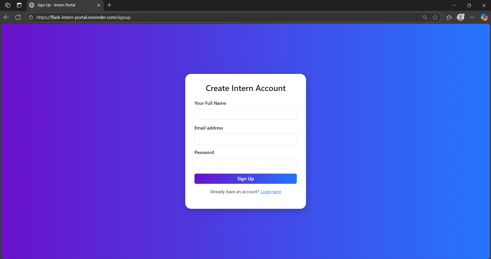
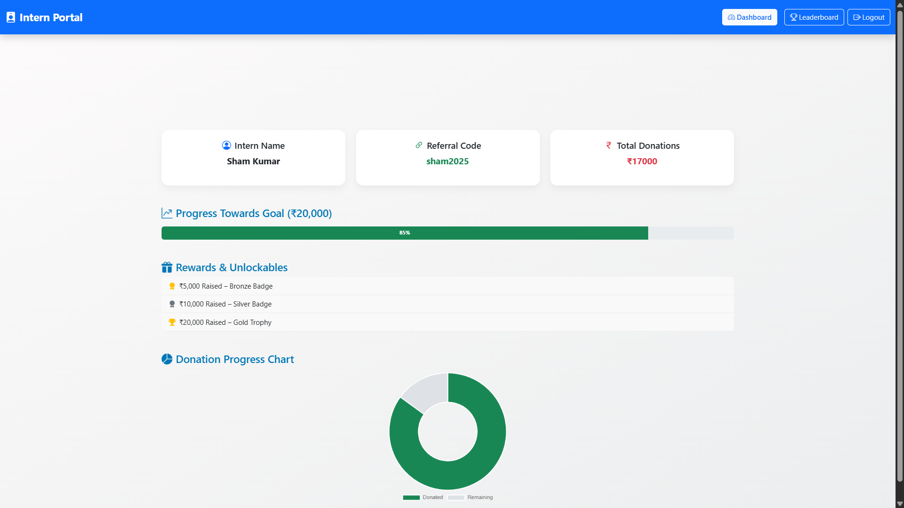
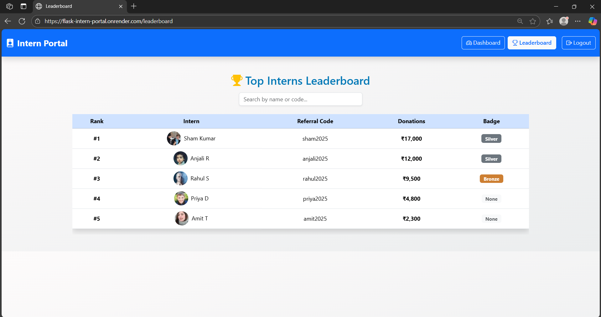

# 🌐 Intern Portal – Full Stack Flask Project

A clean, modern full-stack intern portal built using **Flask + HTML/CSS + Bootstrap 5** with animated charts and Lottie UI effects. Ideal for internship evaluation tasks.


---

## 🚀 Features

✅ Dummy Login / Signup with session handling  
✅ Intern Dashboard with animated charts  
✅ Leaderboard with rank badges and search  
✅ Mobile responsive design  
✅ Hosted on [Render](https://render.com)  

---

## 📸 Screenshots

### 🔐 Login Page


### 🆕 Sign Up Page


### 📊 Dashboard


### 🏆 Leaderboard



---

## 🛠️ Tech Stack

- **Frontend:** HTML5, CSS3, Bootstrap 5, AOS.js, Lottie, Chart.js  
- **Backend:** Flask (Python)  
- **Deployment:** GitHub + Render

---

## 🧩 Project Structure

```
├── app.py
├── templates/
│   ├── login.html
│   ├── signup.html
│   ├── dashboard.html
│   └── leaderboard.html

```

---

## 💻 Local Setup

1. **Clone the Repo:**
   ```bash
   git clone https://github.com/yourusername/flask-intern-portal.git
   cd flask-intern-portal
   ```

2. **Create Virtual Environment:**
   ```bash
   python -m venv venv
   source venv/bin/activate  # On Windows: venv\Scripts\activate
   ```

3. **Install Dependencies:**
   ```bash
   pip install -r requirements.txt
   ```

4. **Run the App:**
   ```bash
   python app.py
   ```

5. Open in browser: [http://localhost:5000](http://localhost:5000)

---

## 🌍 Deployment (Render)

1. Push code to GitHub
2. Go to [Render Dashboard](https://dashboard.render.com)
3. Click **“New → Web Service”**
4. Link your GitHub repo
5. Set:
   - **Build Command:** `pip install -r requirements.txt`
   - **Start Command:** `python app.py`
6. Deploy 🚀

---

## 🔐 Dummy Credentials

> You can use these for demo purposes:

- **Email:** `intern@gmail.com`  
- **Password:** `1234`

---

## ✨ Credits

- Designed & Developed by [Shyam Kumar](https://github.com/shyam007-srec)
- Inspired by internship Round 1 task instructions

---

## 📄 License

This project is licensed under the MIT License – feel free to use, modify, and share.
